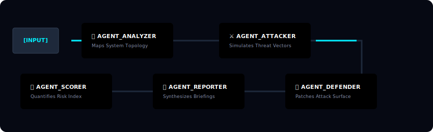

# HackerMind 🧠🔓

<p align="center">


</p>

<p align="center">

</p>

Modern cybersecurity threats hide deep within your structural abstractions—inside undocumented APIs, misconfigured database roles, implicit IAM trust structures, and unratified session boundaries. **HackerMind** tears them apart.

Describe any system topology. HackerMind deploys an orchestrated **5-agent sequential reasoning pipeline** powered by **Microsoft Foundry IQ (Azure OpenAI gpt-4.1-mini)**. Rather than simply generating static text, these specialized Foundry agents act as autonomous, tool-using intelligence nodes ("brains"). They maintain multi-turn contextual memory, collaborate to simulate character behaviors, and dynamically update the system's world state to map, audit, defend, and quantify risk vectors in real time. 

Built specifically for the **Microsoft Agents League Hackathon 2026 — Creative Apps Track**.

---

## 🎬 Demo Media

> 📹 [Watch the Full Multi-Agent System Demo →](https://youtu.be/U24y8VNIywA?si=MEhkdV2BCKhSMgTX)
>  
> 🌐 [Launch the Production Web App →](https://hackermind-rhea-dsasf9bfbba5h7hc.swedencentral-01.azurewebsites.net)

---

## 🤖 The Orchestration Engine: 5 Autonomous Foundry Agents

HackerMind rejects primitive, isolated parallel API hits. Instead, it utilizes an advanced multi-turn agent network where each specialized **Microsoft Foundry Agent** acts as an autonomous node. Powered by **Microsoft Foundry IQ**, these agents function as the underlying "brains" of the simulation—maintaining sequential memory, reasoning over inputs, and dynamically updating the system's world state across multiple turns.

| Agent Identity | Persona & Role | Operational Vector & Decision-Making |
|---|---|---|
| 🔍 **AGENT_ANALYZER** | **System Cartographer** | Parses natural language inputs, identifies structural dependencies, maps network topologies, and establishes the baseline environment state. |
| ⚔️ **AGENT_ATTACKER** | **Adversarial Hacker** | Simulates nation-state threat vectors—acts as an autonomous adversarial NPC to identify software vulnerabilities and execute complex exploit chains. |
| 🛡️ **AGENT_DEFENDER** | **Security Architect** | Ingests the adversarial threat map and generates isolated, actionable mitigation patterns, patching criteria, and defensive controls. |
| 📋 **AGENT_REPORTER** | **Intelligence Officer** | Compiles the collective output streams and narrative context into an enterprise-ready, structured security intelligence briefing report. |
| 📊 **AGENT_SCORER** | **Risk Quantifier** | Evaluates the final compromised state across six specialized vectors, normalizing threat data into a localized scoring index (0 to 100). |

---

## ✨ Core Features & Architectural Alignment

### 🧠 Multi-Agent Stateful Reasoning Chains
Built directly on top of the **Microsoft Foundry IQ** engine, each execution sequence runs through a true stateful pipeline. Instead of handling simple static API requests, the agents simulate a continuous, multi-turn context matrix where the output of the preceding node alters the global world state.

<p align="center">
  
</p>

### 📊 Real-Time Threat Dimension Matrix
The scoring subsystem maps telemetry across six distinct attack dimensions, updating vectors instantaneously to gauge system resilience based on the collaborative outputs of the red/blue agent team.

### 🗺️ Mouse-Reactive Interactive 3D World State Topology
A high-fidelity, interactive **3D spatial map** built with responsive CSS 3D perspectives acts as the frontend rendering engine for the agents' collective decisions. 
* **Dynamic State Management:** Each major resource class (Web Server, API Gateway, Database, Cloud Mesh) renders as an independent structural node. 
* **Real-Time Visual Diagnostics:** Nodes dynamically color-shift (Glow Red &rightarrow; Critical, Amber &rightarrow; Warning, Green &rightarrow; Secure) relative to the deterministic risk parameters passed straight from the Foundry Agent array, exposing an on-click diagnostic panel.

### 🔬 Contextual Defense Lab
A dedicated defensive sandbox that evaluates mitigation strategies against custom metrics (**Resilience, Coverage, and Mitigation**). The library automatically exposes compliance controls matching the exact threat profiles uncovered by the autonomous agent network.

### 💻 Retro-Cyberpunk Immersive UI Shell
Deploys an optimized frontend terminal workspace leveraging glassmorphic design paradigms, featuring:
* Dynamic background grid overlays and CSS animation loop scanlines.
* Live analysts terminal text tickers updating system tasks during multi-step runs.
* Lightweight DOM management structures avoiding heavy framework overhead.

---

## 🏗️ System Architecture


---

## 🛠️ Technology Stack Matrix

| Architectural Layer | Target Technology | System Function |
|---|---|---|
| **Frontend UI** | HTML5, CSS3 (3D Transforms), Vanilla JS, Tailwind CSS | High-fidelity interactive presentation layer |
| **Backend Gateway** | Python (v3.10+), Flask Framework | Request routing & payload serialization |
| **AI Intelligence** | Microsoft Foundry IQ Engine | Sequential multi-agent orchestration controller |
| **Cloud Hosting** | Azure App Service (Sweden Central Region) | Highly-available production environment |
| **Development Tool**| GitHub Copilot | Structural layout scaffolding & debugging partner |

---
## 🚀 System Lifecycle & Initialization

> ### 🛰️ [SYSTEM_CORE] RUNNING LOCAL DEPLOYMENT CYCLE
>
> #### Prerequisites
>
> - Python 3.10+
> - Azure OpenAI deployment (Microsoft Foundry IQ)
>
> #### Installation
>
> ```bash
> # Clone the repository
> git clone [https://github.com/rh3eeacysec/hackermind.git](https://github.com/rh3eeacysec/hackermind.git)
> cd hackermind
>
> # Install dependencies
> pip install -r requirements.txt
>
> # Configure environment variables
> # Create a .env file with:
> # AZURE_OPENAI_KEY=your-key
> # AZURE_OPENAI_ENDPOINT=your-endpoint
> # AZURE_OPENAI_DEPLOYMENT=hackermind-gpt
>
> # Start the server
> python app.py
> ```
>
> Open your browser at `http://127.0.0.1:5000`
>
> #### Environment Variables
>
> ```env
> AZURE_OPENAI_KEY=your-azure-key
> AZURE_OPENAI_ENDPOINT=[https://your-resource.openai.azure.com/](https://your-resource.openai.azure.com/)
> AZURE_OPENAI_DEPLOYMENT=hackermind-gpt
> ```

```bash
# Execute the application gateway thread
python app.py

```

Open your target browser engine and link directly to the local routing loop: `http://127.0.0.1:5000`

### `POST /api/analyze`

Triggers the full, autonomous five-turn reasoning loop using the specified configuration strings.

**Request Structural Body:**

```json
{
  "system_description": "A web application with login page, MySQL database, REST API hosted on AWS EC2 with admin panel accessible from internet"
}

```

**Response Structural Body:**

```json
{
  "analysis": "Architectural breakdown details...",
  "vulnerabilities": "Exploit vector maps...",
  "defenses": "Structural mitigation controls...",
  "report": "Complete text reporting output...",
  "scores": {
    "sql_injection": 75,
    "xss": 60,
    "auth_bypass": 80,
    "api_security": 65,
    "data_exposure": 85,
    "network_attack": 70
  },
  "overall_risk": 72
}

```

---

## 🤖 GitHub Copilot Utilization Log

GitHub Copilot acted as an active pair programmer to help scaffold complex transformations, automate logic, and map complex data routes:

* **Multi-Agent Context Flow Pipelines:** Guided the design of the serial agent execution routine within Flask, ensuring data states from preceding steps pass accurately into subsequent prompts.
* **API Error Handlers:** Co-authored error intercept blocks managing API timeout errors or format abnormalities gracefully with robust text fallbacks.
* **3D Transform Matrix Math:** Generated the custom mouse-reactive JavaScript calculation listeners that map screen cursor coordinates to 3D CSS rotate variables, achieving smooth canvas motion.
* **JSON Data Sanitation:** Automated the formatting blocks used to extract raw numerical JSON strings out of mixed LLM markdown responses, safely handling missing parameter keys.

---

## 🏆 Hackathon Evaluation Matrix Alignment

| Evaluation Category | Total Weight | Practical Execution & Metrics in HackerMind | Current Status |
| --- | --- | --- | --- |
| **Accuracy & Relevance** | 20% | Deployed fully inside the Creative Apps track. Harnesses Microsoft Foundry IQ as its core multi-agent engine. Built, audited, and optimized continuously via GitHub Copilot workflows. Hosted natively on Azure App Service. | **100% Implemented** |
| **Reasoning & Multi-step Thinking** | 20% | Executes an advanced sequential agentic chain. Information is evaluated iteratively (ANALYZER → ATTACKER → DEFENDER → REPORTER → SCORER), modeling proper security engineering pipelines. | **100% Implemented** |
| **Creativity & Originality** | 15% | Merges real-world defensive engineering threat logic into an atmospheric cyberpunk UI. The implementation of mouse-tracking 3D topology visuals provides a striking alternative to standard flat security audit dashboards. | **100% Implemented** |
| **User Experience & Presentation** | 15% | Live environment fully accessible on Azure for evaluation teams. Offers immediate testing inputs alongside fluid layout alerts, terminal tickers, and interactive node widgets. | **100% Implemented** |
| **Reliability & Safety** | 20% | Absolute isolation of runtime secrets through Azure Application Environment slots. No API endpoints or hardcoded configuration keys exist in the open repository history. Built-in error boundaries preserve system execution state. | **100% Implemented** |
| **Community Engagement** | 10% | Instantly comprehensible, highly visual concept that allows users to interactively map out and break down complex IT setups in seconds. | **100% Implemented** |

---

## 🔒 Security Policy Enforcement

* **✅ Token Security:** No live access tokens, secrets, configuration properties, or credentials reside within this public code history.
* **✅ Environmental Isolation:** The configuration system strictly requires standard `.env` separation, matching local entries in the `.gitignore` mapping array.
* **✅ PII Safety:** Zero user profile tracking logs or system data indices are collected or saved to persistent database sheets.
* **✅ Compliance Guardrails:** All analysis structures adhere to ethical disclosure concepts. For platform details see the Microsoft Security Policy.

---

## 👩‍💻 About the Engineer

Hi, I'm **Rhea Prajapati** — a cybersecurity and digital forensics student building at the intersection of automated defensive networks, threat architecture mapping, and adaptive AI agent systems.

HackerMind was born from a specific architectural question: *Can an organized team of specialized AI agents mimic the strategic, multi-disciplinary thinking of a human red/blue security team to audit an infrastructure map within seconds?* By offloading contextual reasoning pipelines to Microsoft Foundry IQ and decoupling it into a fast, interactive front-end display, HackerMind makes complex architectural security auditing instant, thorough, and visually actionable.

**Core Areas of Focus:**

* 🔐 Structural Threat Modeling & Attack Surface Evaluation
* ☁️ Enterprise Mesh Infrastructure & Cloud Security Architecture
* 🌐 Application Protocol Analysis & Edge Penetration Audits
* 🤖 Automated Multi-Agent Networks & LLM Framework Integration

---

## 👤 Project Metadata

* **Author:** Rhea Prajapati
* **Microsoft Learn Profile:** Rhea-8387
* **GitHub Code Repository:** @rh3eeacysec
* **Target Event:** Developed exclusively for the Microsoft Agents League Hackathon 2026 — Creative Apps Challenge Track
* **Core Accelerators:** Powered by Microsoft Foundry IQ and Accelerated via GitHub Copilot

*Five agents. One environment. Absolute clarity regarding your security stance in seconds. Defend with precision. Code with confidence.*
